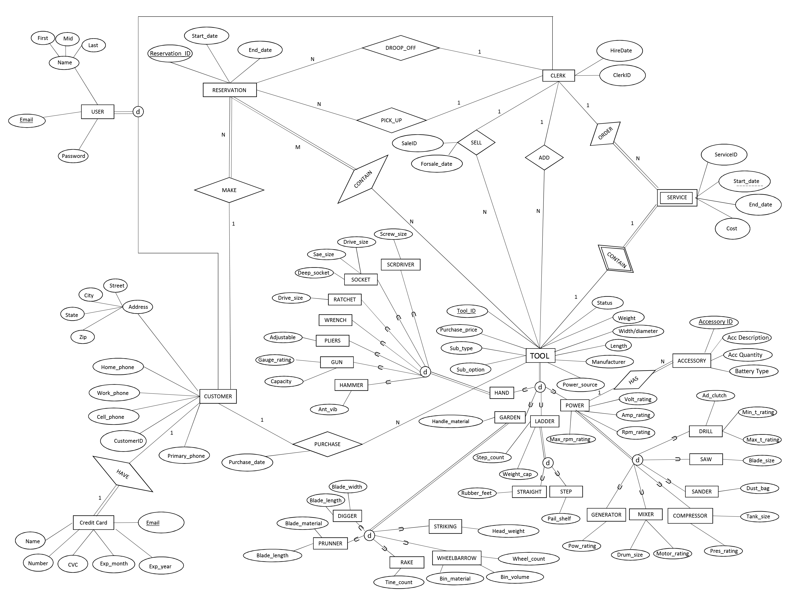
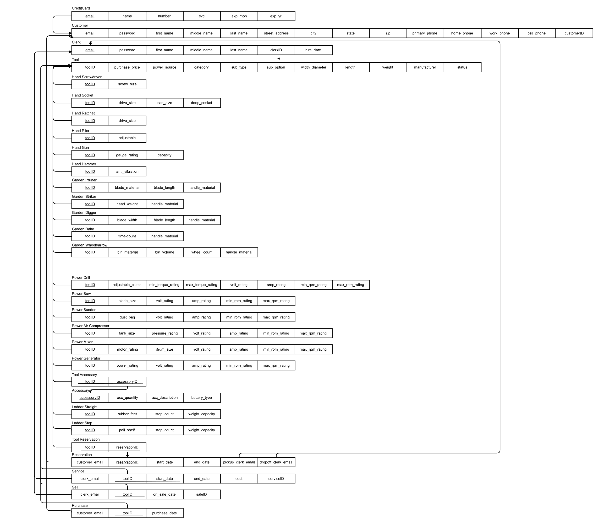

# Tool Rental Store

## 1 Project Overview

A tool rental store has decided to try out a new online tool rental service for its customers. My job is to develop the information management system that supports the online inventory, reservation services, and maintenance services. 

### 1.1 Tool

**Tool Type:** The store has four types of tools available for rental: Hand Tools, Garden Tools, Ladders, and Power Tools. Hand tools include items such as wrenches, sockets, screwdrivers, hammers, etc. Garden tools include digging tools, pruning tools, trimmers, rakes, wheelbarrows, and striking tools. Ladders include straight and step. Power Tools include drills, saws, sanders, mixers,
etc.

**Power Type:** Tools are also divided into 4 separate sub-types based on power source: 110-240 Volt A/C electric (corded), 7.2-80.0 Volt D/C battery powered (cordless), gas-powered, and manual (no motor). Garden Tools may run on any power-source: manual, gas, electric, or cordless. All Ladders, all Hand Tools are considered manual powered.

**Accessories:** Tool accessories are unique to power tools and must be listed separately (e.g. drill bits, hose, gas tank, hard case, safety wear, etc). Each tool may have more than one accessory. All accessories must be paired at the time of rental and/or sale with their applicable power tool.

### 1.2 Customers

**Register and Login:** A Customer is any user interested in renting a tool. A Customer registers by providing contact information and optional credit card information on the Registration form. A Customer logs in by entering the username and password and selecting the “Customer” radio button on the Login form.  

**View Profile:** When a rental Customer selects the “View Profile” task from the main menu, the View Profile page is loaded listing the user's profile information and rental history. The rental history lists the summaries for all reservations made by the user, ordered from most recent to oldest, including the names of Clerk who handled each part of the reservation (pick-up/drop-off).

**Check Tool Availability:** Customers have the option to customize a search for a given tool by using any combination of start/end dates, tool category, power-source/sub-types, and/or keyword search. After pressing the search button, the rental Customer is presented with the inventory available during their specified time frame and search criteria, displaying unique tool number, a short-description, deposit price, and rental price.

**Make Reservation:** Customers are free to add/remove tools to their reservation request with a limit of no more than 10 tools per reservation. When the “Calculate Total” button is pressed, a summary of the reservation withe rental prices and deposit prices is displayed before being entered into the system. When the “Submit” button is pressed, a final reservation screen pops up if the reservation is successful, displaying the unique confirmation number in addition to the reservation summary with totals.

### 1.3 Clerk

**Login:** A Clerk on duty represents the employee responsible for handling the tool inventory. The profile information of a Clerk is entered into the system by a System Administrator. A Clerk logs in by entering the username and password and selecting the "Clerk" radio button on the Login form. 

**Pick-Up Reservation:** The Clerk’s primary task is to handle the pick-up and drop-off of tools that Customers have reserved. When the Pick-up Reservation form is loaded, it automatically shows all reservations which are waiting to be picked up. The Clerk can either enter the specific reservation number or clicks a link to view more details about the selected reservation. After the desired reservation number is entered and the “Pick-Up” button is pressed, a summary of the reservation is displayed.

**Drop-Off Reservation:** The drop-off task is essentially the same as pick-up. At the end of the task, a final receipt is automatically loaded into the browser to be printed for the Customer's records. 

**Add Tool:** The Clerks are also responsible for adding new tools to the inventory. Every tool inserted has an abbreviated description, an original purchase price, and a detailed information applicable to the specific tool. In addition, accessories are separately listed for power tools to ensure tools are complete when they are picked up or dropped off.

**Generate Report:** The Clerk Report is generated to track the clerks' progress in handling pick-ups and drop-offs. The Customer Report is generated to list the information of all rental Customers and number of rentals. The Tool Report is generated to list every item in inventory with description, price, status and expected available date. 

## 2 Database Design

### 2.1 Enhanced Entity-Relationship Diagram

### 2.2 EER to Relation Mapping

